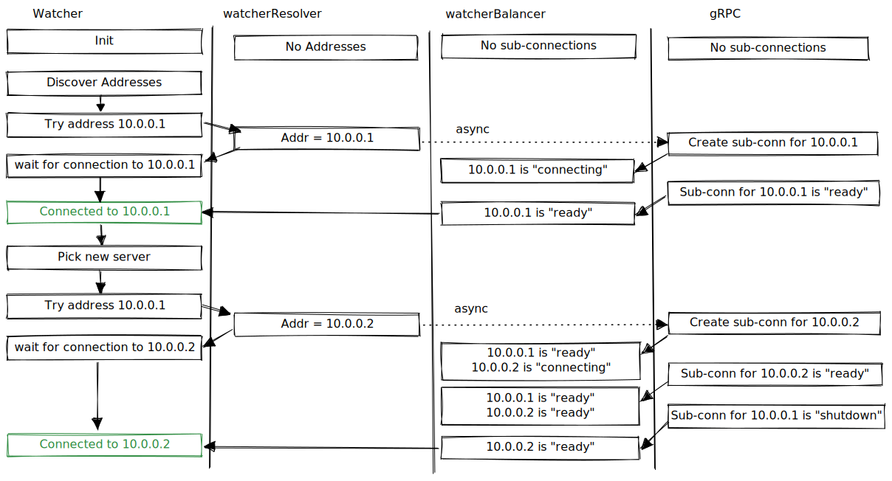

# Integration with `grpc-go`

The explains some of how and why this library integrates closely with gRPC.

The Watcher will sometimes need to switch from one Consul server to another. For example, it will
switch to another Consul server if the current server is unreachable, or it is receiving errors
from this Consul server, or if this Consul server told it to switch for xDS load balancing.

The UX goal here is for the gRPC connection object to automatically and transparently update its
address, so that callers of the library do not need to rebuild their gRPC clients.

## Custom gRPC resolver

We use a custom gRPC resolver to update the address the gRPC connection is using. We get a sort of
handle (`resolver.ClientConn`) that allows us to update state on the gRPC connection
(`grpc.ClientConn`), and that includes updating the connection's address.

The custom gRPC resolver is the one way that the Watcher sets the address on the gRPC connection.
When the gRPC connection is first created using `grpc.Dial`, it initially has no address:

```go
conn, err := grpc.DialContext(w.ctx, "consul://", dialOpts...)
```

Having no address is a "valid" state for the connection. The Watcher also clears the connection's
address list as part of the process of switching servers. Whenever the Watcher next discovers Consul
server addresses and selects an address to connect to, it will update the gRPC connection with an
address via the custom resolver.

## Async connection switching

When using the custom gRPC resolver, we set a new address for the connection to use. GRPC then
handles the process of switching to the new address, asynchronously. The gRPC connection supports
multiple sub-connections. After calling `resolver.ClientConn.UpdateState` to switch addresses the
gRPC connection will have multiple sub-connections for some amount of time.

In general with our usage, we specify at most one "intended" address on the connection at time, so
there are at most two sub-connections at any time. When the Watcher switches from one address
to another via the custom resolver, the gRPC connection will shut down the sub-connection for the
"old" address and create a new sub-connection for the "new" address.

## Motivation for the custom gRPC balancer

A big question: why do we have the custom gRPC balancer?

While the gRPC connection is asynchronously switching from one address to another, we want to answer
the following type of questions to determine if it has connected to that address:

* Which sub-connection or address is the gRPC connection currently using?
* Has the connection finished switching from one sub-connection to another? Has it definitely
  stopped using the "old" sub-connection?
* Which sub-connection or address returned this gRPC response or error?

Because of library abstractions, we don't have immediate answers to these. The gRPC connection
automatically picks a sub-connection when there are multiple, and the response and error types
don't seem to contain the remote server address.

The goal of the library is to provide a connection to a "known good" Consul server - a server that
we were certainly able to connect to successfuly. But that is difficult if the connection could
be using one of two sub-connections and if we cannot reliably map a response or error back to a
specific server.

So, we resort to using a gRPC balancer to help solve this.

## Custom gRPC balancer

We use a gRPC balancer to give us insight into the current state of the gRPC sub-connections. We do
not actually use the custom balancer for a load balancing strategy. In particular, we do not use it
as part of the library's compatiblity with the Consul server's xDS load balancing. It's purely a
tool to view the gRPC sub-connection states in order to work around library abstractions.

Our custom balancer is a wrapper around a gRPC `base.Balancer` so that our custom balancer is
invoked whenever a sub-connection is created or when sub-connection state changes. The custom
balancer lets us answer these questions:

* Which sub-connections are currently being used?
* What are the addresses for those sub-connections?
* What connectivity state are the sub-connections in?

Using this information, the Watcher uses the following process to switch to another Consul server
address:

1. Use the custom resolver to update the connection with the new address
2. Use the custom balancer to monitor sub-connection state until the switch to the new address is
   complete.

Specifically, we block until there is one ready sub-connection for the new address, and all other
sub-connections, if any, have been shut down. The sub-connection for the new address may never
be ready (for example, if the server is unavailable) so this will time out after a short while
and assume we failed to connect to that server.

The following example diagram shows the connection state transitions:


