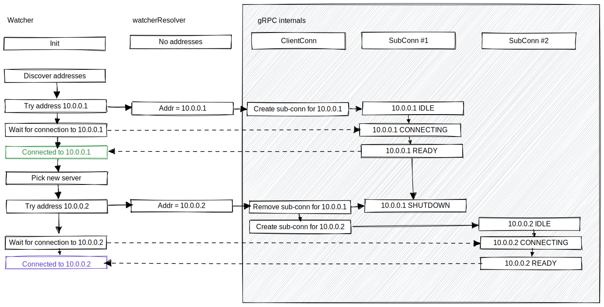

# Integration with `grpc-go`

The explains some of how and why this library integrates closely with gRPC.

The Watcher will sometimes need to switch from one Consul server to another. For example, it will
switch to another Consul server if the current server is unreachable, or it is receiving errors
from this Consul server, or if this Consul server told it to switch for xDS load balancing.

The UX goal here is for the gRPC connection object to automatically and transparently update its
address, so that callers of the library do not need to rebuild their gRPC clients.

## Custom gRPC resolver

We use a custom gRPC resolver to update the address the gRPC connection is using. 
The Watcher tracks known addresses and uses the resolver to set the address on the gRPC connection.
When the gRPC connection is first created using `grpc.Dial`, it initially has no address:

```go
conn, err := grpc.DialContext(w.ctx, "consul://", dialOpts...)
```

Having no address is a "valid" state for the connection. The Watcher also clears the connection's
address list as part of the process of switching servers. Whenever the Watcher next discovers Consul
server addresses and selects an address to connect to, it will update the gRPC connection with an
address via the custom resolver.

## Connection switching

When using the custom gRPC resolver, we set a new address for the connection to use. GRPC then
handles the process of switching to the new address. After calling `resolver.ClientConn.UpdateState` 
to switch addresses the gRPC connection will gracefully close the existing sub-connection and open 
a new sub-connection for the new address.

In order to track which address we are connected to, we pass at most one "intended" address to the resolver,
so there is at most one active sub-connection at any time.

The following example diagram shows the connection state transitions:



